.. _exploring:

======================================
 Exploring social media data with ELK
======================================

The ELK (`Elasticsearch <https://www.elastic.co/products/elasticsearch>`_, `Logstash <https://www.elastic.co/products/logstash>`_,
`Kibana <https://www.elastic.co/products/kibana>`_) stack is a general-purpose framework for exploring data. It
provides support for loading, querying, analysis, and visualization.

SFM provides an instance of ELK that has been customized for exploring social media data. It currently supports data from
Twitter and Weibo.

One possible use for ELK is to monitor data that is being harvested to discover new seeds to select.
For example, it may reveal new hashtags or users that are relevant to a collection.

Though you can use Logstash and Elasticsearch directly, in most cases you will interact exclusively with Kibana,
which is the exploration interface.

--------------
 Enabling ELK
--------------
ELK is not available by default; it must be enabled as described here.

You can enable one or more ELK Docker containers. Each container can be configured to be loaded with all social
media data or the social media data for a single collection set.

To enable an ELK Docker container it must be added to your ``docker-compose.yml`` and then started by::

  docker-compose up -d

An example container is provided in ``example.docker-compose.yml`` and ``example.prod.docker-compose.yml``. These examples
also show how to limit to a single collection set by providing the collection set id.

By default, Kibana is available at `http://your_hostname:5601/app/kibana <http://localhost:5601/app/kibana>`_. (Also,
by default Elasticsearch is available on port 9200 and Logstash is available on port 5000.)

If enabling multiple ELK containers, add multiple containers to your ``docker-compose.yml``. Make sure to give each container a unique name and a unique ``hostname:`` value, and make sure that each container maps to different ports.

----------------
 Configuring ELK
----------------
For production use,  We need to pay attention to a number of best practices settings for ealsticsearch container, kibana container and logstash container.

Docker Host
===========
1.Make sure your host Docker has been updated to at least 1.12.

2.The ``vm_max_map_count`` kernel setting needs to be set to at least 262144 for production use. For detail setting, please take a look at the `official document <https://www.elastic.co/guide/en/elasticsearch/reference/5.x/docker.html#docker-cli-run-prod-mode>`_.

Elasticsearch
=============
The following configurations are recommended for the best practices in `official setting <https://www.elastic.co/guide/en/elasticsearch/reference/5.3/docker.html>`_.

1.It is important to correctly set capabilities and ulimits via ``docker-compose.yml``. As you can see in the ``example.prod.docker-compose.yml``.

2.Ensure ``bootstrap.memory_lock`` is set to true as explained in `Disable swapping <https://www.elastic.co/guide/en/elasticsearch/reference/5.3/setup-configuration-memory.html>`_.

3.Use the `ES_JAVA_OPTS` environment variable to set heap size, e.g. to use 2GB use ``ES_JAVA_OPTS="-Xms2g -Xmx2g"``. It is also recommended to set a memory limit for the container. For best practices, assign enough memory (e.g. 6GB) for elasticsearch,

4.To enable `X-Pack <https://www.elastic.co/guide/en/x-pack/5.3/index.html>`_ monitoring, you also need to set the corresponding value ``XPACK_MONITORING_ENABLED`` to `true` at the kibana container.
The default value is `false` since it involves license management and update even though the monitoring feature is free for the `basic license <https://www.elastic.co/subscriptions>`_.

5.Configuring a correct wait seconds for checking the application dependencies. For the first time, the elasticsearch usually start in a short time, you can set to 90 seconds.
For restarting with large amount data or enable the monitoring feature, the elasticsearch and kibana will take a little longer to completely start. In this situation, you can set to 120 or 180 seconds.

Kibana
=========
1.For production use, set ``LOGGING_QUIET`` to true which suppress all logging output other than error messages.For development purpose, we can set the log level based on the following table:

+-----------------+----------------------------------------------------------------+-------------------------------------------------------------------------------------------------------------------------------------------+
| setting         | desc                                                           | effect                                                                                                                                    |
+-----------------+----------------------------------------------------------------+-------------------------------------------------------------------------------------------------------------------------------------------+
| logging.silent  | bool                                                           | no output, don't even setup the logging output                                                                                            |
+-----------------+----------------------------------------------------------------+-------------------------------------------------------------------------------------------------------------------------------------------+
| logging.quiet   | bool                                                           | Only log messages tagged with error or fataltags, or errors caught by hapi                                                                |
+-----------------+----------------------------------------------------------------+-------------------------------------------------------------------------------------------------------------------------------------------+
| logging.verbose | bool                                                           | Log all the things, including information about system usage and every request                                                            |
+-----------------+----------------------------------------------------------------+-------------------------------------------------------------------------------------------------------------------------------------------+
| logging.events  | map of log types to the tags they should output. Supports *tag | provides access to every possible combination of logging output filtering. Also can add support for custom loggers setup by plugins, etc. |
+-----------------+----------------------------------------------------------------+-------------------------------------------------------------------------------------------------------------------------------------------+

2.Enable X-PACK monitoring, as explained in elasticsearch configuration part.

3.Configuring a correct wait seconds for checking whether the elasticsearch and kibana has completely start.

Logstash
=========
1.Set enough memory for ``LS_JAVA_OPTS``, usually 2G, to avoid  the error with too small initial heap.

2.Limit to a single collection set by providing the collection set id.

--------------
 Loading data
--------------

ELK will automatically be loaded as new social media data is harvested. (Note, however, that there will be some latency
between the harvest and the data being available in Kibana.)

Since only new social media data is added, it is recommended that you enable the ELK Docker container before beginning
harvesting.

If you would like to load social media data that was harvested before the ELK Docker container was enabled, use the
``resendwarccreatedmsgs`` management command::

    usage: manage.py resendwarccreatedmsgs [-h] [--version] [-v {0,1,2,3}]
                                           [--settings SETTINGS]
                                           [--pythonpath PYTHONPATH] [--traceback]
                                           [--no-color]
                                           [--collection-set COLLECTION_SET]
                                           [--harvest-type HARVEST_TYPE] [--test]
                                           routing_key

The ``resendwarccreatedmsgs`` command resends warc_created messages which will trigger the loading of data by ELK.

To use this command, you will need to know the routing key. The routing key is ``elk_loader_<hostname>.warc_created``.
The hostname is available as part of the definition of the ELK container in the ``docker-compose.yml`` file.

The loading can be limited by collection set (``--collection-set``) and/or (``--harvest-type``). You can get collection
set ids from the collection set detail page. The available harvest types are twitter_search, twitter_filter,
twitter_user_timeline, twitter_sample, and weibo_timeline.

This shows loading the data limited to a collection set::

    docker exec sfm_ui_1 python sfm/manage.py resendwarccreatedmsgs --collection-set b438a62cbcf74ad0adc09be3b07f039e elk_loader_myproject_elk.warc_created

--------------------
 Overview of Kibana
--------------------

The Kibana interface is extremely powerful. However, with that power comes complexity.
The following provides an overview of some basic functions in Kibana.  For some advanced
usage, see the `Kibana Reference <https://www.elastic.co/guide/en/kibana/current/index.html>`_ or the `Kibana 101: Getting Started with Visualizations <https://www.elastic.co/webinars/kibana-101-get-started-with-visualizations>`_ video.

When you start Kibana, you probably won't see any results.

.. image:: images/exploring/no_results.png

This is because Kibana defaults to only showing data from the last 15 minutes. Use the
date picker in the upper right corner to select a more appropriate time range.

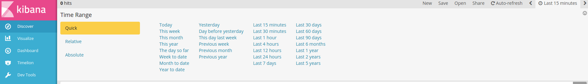

Tip: At any time, you can change the date range for your query, visualization, or dashboard
using the date picker.

Discover
========

The Discover tab allows you to query the social media data.

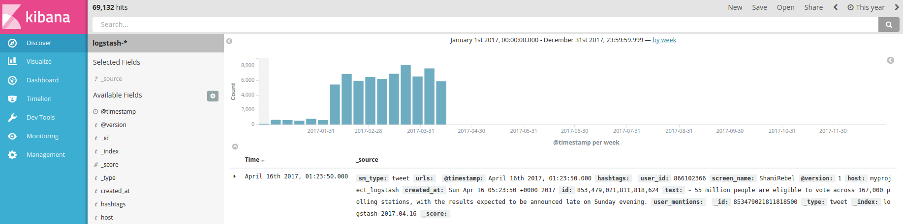

By default, all social media types are queried. By limit to a single type (e.g., tweets),
click the `Open` and select the appropriate filter.

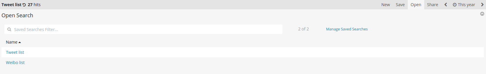

You will now only see results for that social media type.

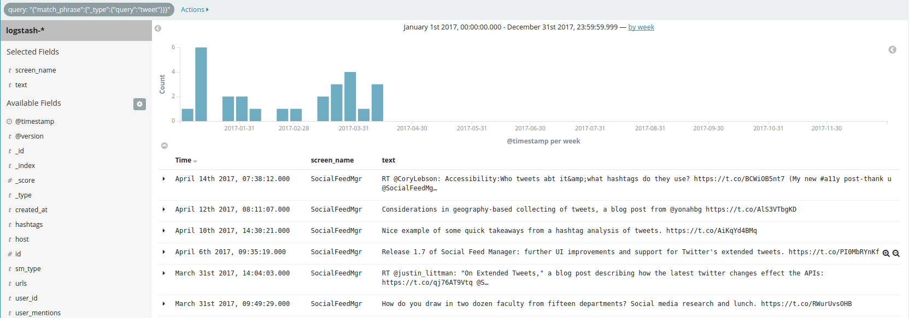

Notice that each social media item has a number of fields.

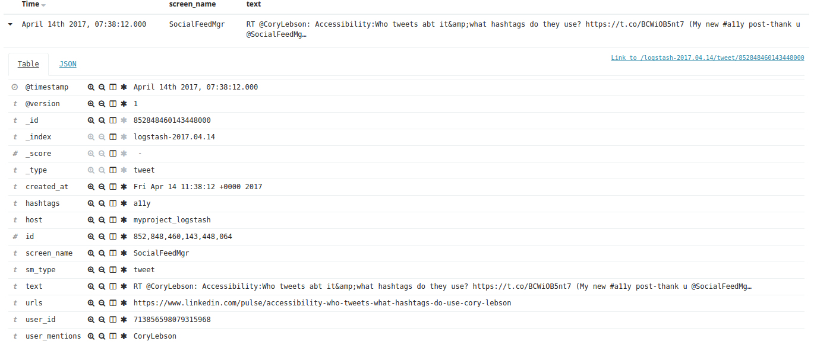

You can search against a field. For example, to find all tweets containing the term "archiving":

.. image:: images/exploring/search_text.png

or having the hashtag #SaveTheWeb:

.. image:: images/exploring/search_hashtag.png

or mentioning @SocialFeedMgr:

.. image:: images/exploring/search_user_mention.png

Visualize
=========

The Visualize tab allows you to create visualizations of the social media data.

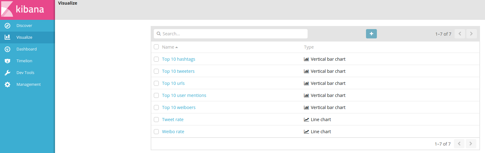

The types of visualizations that are supported include:

* Area chart
* Data table
* Heatmap chart
* Line chart
* Markdown widget
* Metric
* Pie chart
* Tag cloud
* Title Map
* Timeseries
* Vertical bar chart

Describing how to create visualizations is beyond the scope of this overview.

A number of visualizations have already been created for social media data. (The available
visualizations are listed on the bottom of the page.)

For example, here is the Top 10 hashtags visualization:

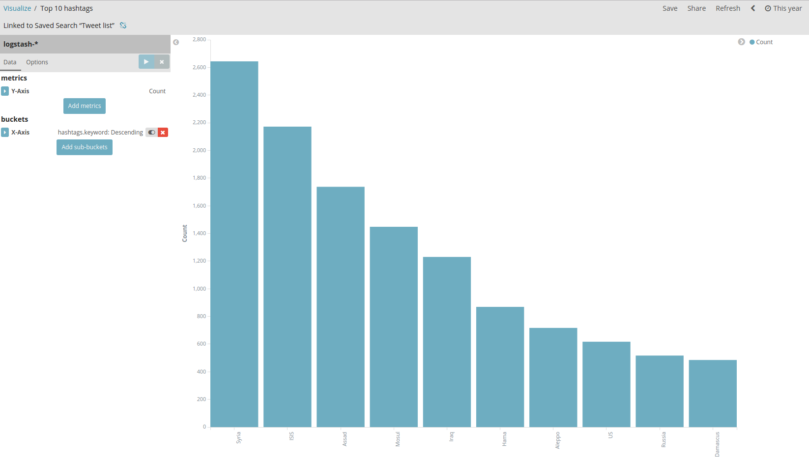

Dashboard
=========

The Dashboard tab provides summary view of data, bringing together multiple visualizations
and searches on a single page.

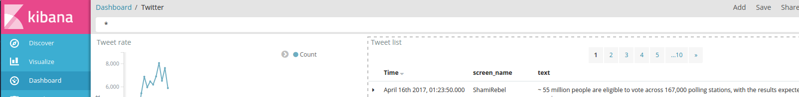

A number of dashboards have already been created for social media data. To select a dashboard,
click the folder icon and select the appropriate dashboard.

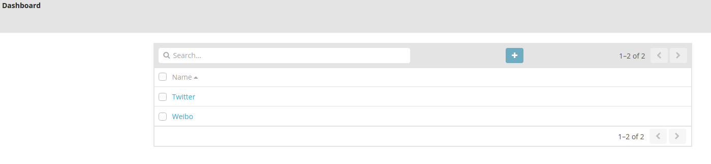

For example, the Kibana default dashboard is Twitter, here is the top of the Twitter dashboard:

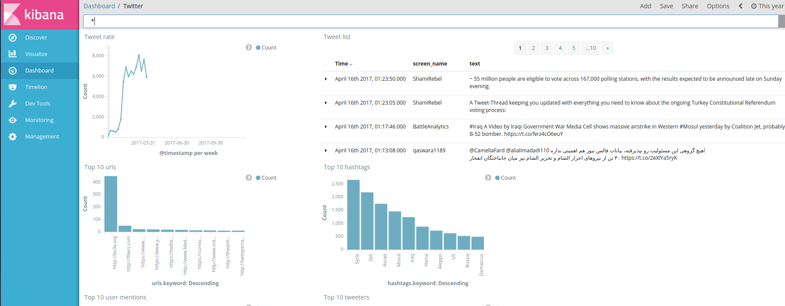

In large dataset, you might enconter a query within a large time interval, e.g. 3 years or 5 years.
However, By default elasticsearch rejects search requests that would query more than 1000 shards. The error would be like:

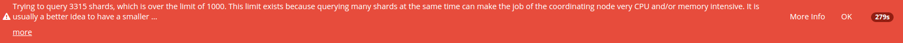

The reason is that such large numbers of shards make the job of the coordinating node very CPU and memory intensive.
It is usually a better idea to organize data in such a way that there are fewer larger shards.
In case you would like to bypass this limit, which is discouraged,
you can update the ``action.search.shard_count.limit`` cluster setting to a greater value like 2000 or more.
To do this, go to the ``Dev Tools`` tab on kibana and run following code :

- setting transient
    PUT _cluster/settings
    {
      "transient": {
        "action.search.shard_count.limit":2000
      }
    }

- setting persistent
    PUT _cluster/settings
    {
      "persistent": {
        "action.search.shard_count.limit":2000
      }
    }

The persistent setting will survive full cluster restarts while the transient setting will be removed after the first full cluster restart.

---------
 Caveats
---------
* This is experimental. We have not yet determined the level of development that will be performed in
  the future.
* Approaches for administering and scaling ELK have not been considered.
* No security or access restrictions have been put in place around ELK.
* Take consideration to include the X-Packt security and account management in the future.
